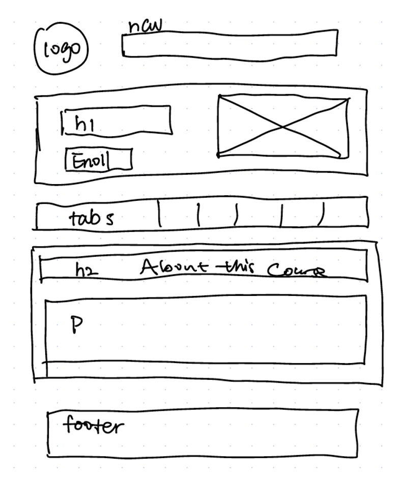

# Group Project: Design Journey

**You are encouraged to work ahead on everything on this project.** (Though we suggest you hold back on the interactivity until Project 3.) **Each section is required for a specific milestone. You are required to have these sections completed before that milestone's deadline.**

**Be clear and concise in your writing.** Bullets points are encouraged.

**Everything, including images, must be visible in Markdown Preview.** If it's not visible in Markdown Preview, then we won't grade it. We won't give you partial credit either. This is your warning.


# Client (Milestone 1)

## Client Questionnaire (Milestone 1)

1. Describe your organization and its purpose.
- Purpose 1: Engage the public. Let them know resources they have
- Purpose 2: Attract people to take course


2. What makes your organization and its services special or unique?
- Apply research to teaching → based on cutting edge research
- Course updated very often
- Researchers and professor from cornell
- Participants are a diverse, global audience: environmental educators, teachers k-12, high school students, volunteers, parents.
- Address real world challenges, specifically sustainability and environmental


3. Why are you looking for a new website or updating your existing site? Do you want to keep all the existing content or adjust them?
- Home Page: Principles of the organization (redesign to look more professional and easy to read.
- Specific courses: just a list of courses with videos, descriptions, and enrollment (redesign to look more appealing)
- Statistics page: just to show off what the lab has done (maybe do? Could be incorporated in the home page).
- Resources/Publications: should have a list of projects you can do in the lab. Used by teachers to develop lesson plans, 25 plans (split into two sites).
- Gallery page: for images related to lesson plans. Explore nature and take photos, explain why they relate to nature to you?
- Gathering page: social media posts, etc. (make it more lively).


4. Who do you want to visit your site? Who is your site's target audience?
- Global audience: environmental educators, teachers k-12, high school students, volunteers, parents.
- Students and teachers interested in joining or teaching in a Conrell ecology lab.


5. When visiting your site, what actions do you want your visitors to take?
- Register, download resources, and follow social media (facebook, inst)


6. Is there a "feel" that you want for your site? Are there colors or imagery that you have in mind?
- No strong preference
- Bright, environment
- Gallery page, with outcomes and map of students all over the world
- Maintain professionalism
- Does not have to be consistent with the rest of the site


7. What are your three favorite competitors or similar organizations' sites? Why?
- She really likes the content and design for the website for E Cornell.


## Client Description (Milestone 1)
> Tell us about your client. Who is your client?
> Explain why your client meets the client rules in the project requirements.

- Our client Yue Li is a Research Associate in the Department of Natural Resources and the Environment at Cornell University. And fulfills the clients rules because of the following:
    - Our client is not one of the members of our group.
    - None of us are associated with the Department of Natural Resources and the Environment.
    - None of use knew who this client was before hand, and therefore have no close personal relationship with said client.


## Client Website (Milestone 1)
> Tell us about the website that your client wants. Tell us the purpose of the website and what it is all about.
> NOTE: **If you are redesigning an existing website, give us the current URL and some screenshots of the current site.** (FireFox makes it easy to take a full screenshot of a page.) Tell us how you plan to update the site in a significant way that meets the project's requirements.

The existing one has too many contents, and she wants us to just focus on the original learning page in the existing website and make a website covering four aspects of it: basic introduction, course description, resources, and a gallery of outcomes.
The purpose of the website is 1. engage the public and share resources about nature, and 2. Have audience register and take the course
Site link: <https://www.civicecology.org/>


## Client Website Scope (Milestone 1)
> Your project should be ambitious, but not too large. A good rule-of-thumb is that you should have about 1 content-full page for each team member.
> Explain why the website you will create for your client isn't too small and isn't too big. Explain why you think it's the right size for this project.

1. landing page
2. one specific course (urban) to redesign
3. resources page such as lesson page
4. gallery page like students social media page
	All four of the members will be making one page from above. Each page contains a considerable amount of information but does not get too specific.


## Client Goals (Milestone 1)
> What kind of website do they want? What are their goals for the site?
> There is no required number of goals. You need as many goals as necessary to reflect your client's desires.

They want a website that appeals to both students and teachers (but on separate sections of the website, excluding the home page).
The clients want their website to be more organized in the manner mentioned above.
A website that can keep their user engaged, even if they don’t want to actually join the lab it is advertising.

- Goal A: Register for courses
- Goal B: Download resources (lesson plans, lab journals).
- Goal C: Follow social media (facebook, insta).


## First Client Meeting Minutes/Notes (Milestone 1)
> Include your notes/minutes from the client meeting.

- Focus on nature education page
- Goal: engage public and share resources and research with general public
- Audience are professionals and educators, teacher, high schoolers, diverse
- Feature newest course at the top
- Possible intro video on landing page
- Include course principles
- Current page is too much → change so that it is easy to read, attract more people
- Redesign course description page
- Attract people to register and check other course registration pages


# Plan/Schedule (Milestone 1)
> Make a plan of when you will complete all parts of this assignment.
> This plan is for your team. There is no required format. Format it so that it works for you!
()

- m1:
    - deadline-Wed 10/27 11:59pm
    - plan: 10/26

- m2:
    - deadline-Wed 11/17 11:59pm
    - plan: 11/16 11:59pm

- final:
    - deadline-Wed 12/1 11:59pm
    - plan: 11/30 11:59pm

- lab13 project show:
    - deadline-Fri 12/3
    - plan: practice on Tuesday regular meeting

- peer evaluations:
    - deadline-Fri 12/3 11:59pm
    - plan: individually before deadline


# Site Design/Plan (Milestone 2)

**Make the case for your decisions using concepts from class, as well as other design principles, theories, examples, and cases from outside of class.**

You can use bullet points and lists, or full paragraphs, or a combo, whichever is appropriate. The writing should be solid draft quality but doesn't have to be fancy.

## Understanding Users (Milestone 2)

### Audience (Milestone 2)
> Briefly explain your site's audience. Be specific and justify why this audience is a cohesive group with regard to your client's site. This audience should not be overly broad nor arbitrarily specific. It should be a cohesive group with similar _goals_.

The site’s audience is a global community of educators, students, and volunteers who are interested in learning more about ecology through the Cornell Civic Ecology lab. They may be interested in learning about ecology for the purpose of teaching others, or for the sake of their own knowledge, or to apply this knowledge to their own research. While the audience is located all over the world, they have the common interest of obtaining ecology knowledge and can do so from the digital courses that the site offers.


### User Interview Questions (Milestone 2)
> Plan the user interview which you'll use to identify the goals of your site's audience.

**User Interview Briefing & Consent:** Hi, I am a student at Cornell University. I'm currently taking a class on web design and for a project I am (re-)designing a web site for _client's name_. I'm trying to learn more about the people that might use this site. May I ask you a few questions? It will take about 10-15 minutes. You are free to quit at any time.

1. Tell me about yourself. Where are you from and what do you do for a living (occupation)? (student: what are you interested in majoring in?) You may omit any personal or private information.
2. What is your background in ecology, if any?
  a. What other knowledge did you acquire?
  b. How do you plan on applying this knowledge in the future?
3. Have you taken any online or in-person ecology courses? (No matter the response) Describe your experience.
4. If you’ve registered for an ecology course before (if not ecology, any online course), did you seek out any information beforehand? Where did you seek out this information? What attracted you to register for your most recent course?
5. While taking the actual course, what were your most and least favorite moments in it?
6. After taking the course, was there any information you wish you had known about the course beforehand or information that you weren't able to find?
7. Did you seek out resources outside of the course?
  a. If so, why did you want to do it, and were those resources helpful?
8. What haven't I asked you today that you think would be valuable for me to know?


**After the interview:** This was really helpful. Thank you so much for agreeing to speak with me today. Have a great day!


### Interview Notes (Milestone 2)
> Interview at least 4 people from your audience. Take notes and include those notes here. Make sure to include a brief description of each interviewee.

**Interviewee 1:**

Description: Audrey Andres is a Cornell Hotel School student from the Bay Area in California.


Notes: Audrey loves Ecology, and she lived in the ecology house (a dorm)  last year at Cornell where she learned a lot of related knowledge about ecology. She is interested in sustainability and creating sustainable businesses. In her personal life, she has a passion for nature and the outdoors. She wants to work for or create her own company in the future focusing on sustainability and hospitality. Specifically, trying to make a benchmark restaurant that focuses on sustainability, since there is so much waste in the restaurant. With climate change, crewships, hotels and restaurants will have to address all of the waste of energy, food, etc. in their operations. She has not taken any online or in person ecology classes, but she is looking at enrolling in ecology classes at Cornell. She has seeked out ecology classes on Class Roster. For learning online, she likes to learn through videos and practice problems. If it is only through reading, nothing could really be absorbed. Most of her online classes are distributed through Canvas, and her least favorite part of Canvas is that the calendar does not have clear due dates, class times in one place. Her favorite part about Canvas is that Canvas is very convenient and she can use it on both her phone and the computer. She gained ecology knowledge mostly from the Cornell Library database or just by looking online through YouTube videos or webpages. Her purpose of researching ecology is for personal purposes/interests. I also showed her the existing webpage, and she pointed out that it would be helpful to put the courses front and center and have a description of the course.


**Interviewee 2:**

Description:
- Behzad Akbari
- From middle east
- Currently living in the capital of Iran
- 28 years old
- Graduated from University of Tehran
- Did masters in environment 6 months ago
- Received Bachelors in engineering in 2017
- Works at University at Tehran as an executive team manager

Notes:

2. What is your background in ecology, if any?
    - Took general ecology class in college
3. How do you plan on applying this knowledge in the future?
    - Wants to apply ecology knowledge in both professional and personal aspects of his life
        - Professional:
    - Want to pass ecology knowledge to other students
    - Wants to teach nature education
        - Personal:
    - Wants kids to grow up surrounded by nature
    - Wants people to reconnect with nature especially because of urbanization
4. Have you taken any online or in-person ecology courses? (No matter the response) Describe your experience.
    - Took “Nature Education” course from Civic Ecology Lab
    - Found it generous of them to have classes without a fee during covid
    - Dedicated several hours a week to course
    - Enjoyed how the course was “brief and enough” - not too short and too long
    - All online courses lasted only one hour so time management was perfect
5. If you’ve registered for an ecology course before (if not ecology, any online course), did you seek out any information beforehand? Where did you seek out this information? What attracted you to register for your most recent course?
First e-learning course
    - One of his friends advertised it in a group and applied for it
6. While taking the actual course, what were your most and least favorite moments in it?
    - Favorite moments:
      - Got a chance to talk to everyone including the professor
      - Course provided free pdf file, did not have to buy a textbook (no additional fees)
    - Least Favorite moment:
      - None so far
7. After taking the course, was there any information you wish you had known about the course beforehand or information that you weren't able to find?
    - Was fully satisfied
    - Did not seek outside info, everything needed was included in the course site
8. What haven't I asked you today that you think would be valuable for me to know?
    - Some people just lost their job, or are in a difficult situation, so would like if they offered an option to waive the fee even after covid
    - Wished that the people who took the course could be considered for possible research opportunities by professors (wants to gain connections from course)


**Interviewee 3:**

Description: Beijing, major in MPA, full-time student at NYU, and also currently a TA in civic ecology lab.


Note:

2. What is your background in ecology, if any?
    - Before joining this lab, no background at all.
    - now she is a TA of a course in this lab
3. How do you plan on applying this knowledge in the future?
    - wish to apply eco knowlefge to public policy or environmental sustainability & climate change.
    - do some volunteering work
4. Have you taken any online or in-person ecology courses? (No matter the response) Describe your experience. Course in this lab.
    - while/after taking the courses, she participated in group research in CHINA YOUTH CLIMATE ACTION NETWORK;  
    - volunteered at Jane goodall's  ROOTS & SHOOTS institution;
    - interned in international natrue travel company
    - why? because to change my major and achieve my career goal, I need to learn from the practice and apply my knowledge in practive as well.
    - helpful? Yes. Through researching, working and the natural networking, I got to know more poeple in this field, which broaden my horizon and helped me connect to more opportunities.
5. If you’ve registered for an ecology course before (if not ecology, any online course), did you seek out any information beforehand? Where did you seek out this information? What attracted you to register for your most recent course?
    - heard it from another person. Knew that this course does not require any experience before (she said it was important), and since she wished to change major to eco at that time, so this course was a good fit.
    - a great opportunity to help her enhance eco background as a person who had never learned it before.
6. While taking the actual course, what were your most and least favorite moments in it?
    - as an international student, the subtitle helped her out sometimes to understand the material more easily.
    - a sense of community, lots of extraccuricular opportunities like guest speech

7. After taking the course, was there any information you wish you had known about the course beforehand or information that you weren't able to find?
    - There is no enough platform to show this lab to the public.
    - she wished she had known that students with no ecology background are not supposed to feel depreciated about themselves and be timid in reaching out for new learning and working opportunities in this field. "You are understood and warmly welcomed to enter this field by the community. As enriching yourself with ecology-related knowledge step by step, you'll find boosting opportunities, and your interdisciplinary enlarge this zone as well.
8. What haven't I asked you today that you think would be valuable for me to know?
    - This lab really welcomes all people with different background
    - the registration fee was not that much, and you can get a free course to try.
    - One professor of the course initiated the Glocal Climate Change Association
    - Being one of the TAs, she with other TAs hold many activities & zoom discussions.


**Interviewee 4:**

Description: He is a junior at Tufts University majoring in Environmental Science, Architecture, and Studio Art with a concentration in sculpture.

Notes:
- He gained interest in ecology through playing in the gorges and rivers during his childhood.
- His studies at college had helped him gain much more specific information and skills revolving around ecology.
- He plans on applying this knowledge in his artistic pursuits as well as architectural and design pursuits in his future career.
- He has taken both online and in person ecology courses. His experience with online courses has been relatively fine, with the exception of there being a lack of interactivity and fieldwork. Which is not an issue with in person courses, which provide much more hands-on learning opportunities.
- He has looked for course information prior to registering for an ecology course, which he found via friends/professors.
- His major requirements and personal interest in ecology are what attracted him to registering for his current courses.
- His favorite moments in online class were solving a problem and doing some sort of fieldwork. His least favorite moments always stem from poor communication on the part of the professor.
- There wasn’t any additional information he wished he had known after taking an online course.
- He did look for resources outside of this course, since he wanted to learn more about the topics that interest him and learn more about the world around me.
- Question asked by him: Information that was related more specifically to the connection between ecology and other aspects of my life?


### Goals (Milestone 2)
> Analyze your audience's goals from your notes above. List each goal below. There is no specific number of goals required for this, but you need enough to do the job (Hint: It's more than 1 and probably more than 2).

Goal 1: Have access to a comprehensive list of resources (links and papers) to use for future ecological application
- **Design Ideas and Choices** _How will you meet those goals in your design?_
  - Create a separate page dedicated to listing resources and including corresponding images associated with the resources.
- **Rationale & Additional Notes** _Justify your decisions; additional notes._
  - Users prefer additional resources to be separate from the broader contents of website, so that it is easier to find.
  - We will also include a list of projects that can act as a template for future research.

Goal 2: Better understand the courses from their description and be compelled to enroll
- **Design Ideas and Choices** _How will you meet those goals in your design?_
  - Reorganize courses so that the descriptions and videos are well structured
  - Make the enroll button clearly visible by using different colors
- **Rationale & Additional Notes** _Justify your decisions; additional notes._
  - Having a similar structure of information for each course will give the audience familiarity and be able to better navigate courses
  - Making the enroll button stand out will catch the audience's attention

Goal 3: Gain a sense of security, professionalism, and community from the website's design
- **Design Ideas and Choices** _How will you meet those goals in your design?_
  - Maintain the current color theme and font styles.
  - Make all of the content have a unified width and borders.
  - Have related content condensed and groups of content spaced out.
- **Rationale & Additional Notes** _Justify your decisions; additional notes._
  - Users need to be able to read the very informative-rich text quickly and without confusion.
  - Current users should not get lost when the design of the site changes too drastically.


## Content Planning (Milestone 2)

**Plan your site's content.**

### Your Site's Planned Content (Milestone 2)
> List the content you plan to include your personal website. This should be a comprehensive list.

- Title
- Course title heading
- Course description paragraphs
- Images from projects
- Links to social medias
- Links to enroll
- Videos
- Civic ecology lab logo
- Cornell logo
- Navigation bar
- Footer
- Link to top of page or fixed nav bar
- Copyright information
- Lists of resources and projects
- Enroll button
- Image of map


### Content Justification (Milestone 2)
> Explain (about a paragraph) why this content is the right content for your site's audience and how its addressed their goals..

The content listed above is suitable for our audience because it satisfies their goals. The list of resources and projects combined with their links will allow the audience to easily access this list. In addition, the course title heading and description paragraph will thoroughly explain each course and the separate enroll button element will be clearly visible so that the user does not have to search for it. Other content such as the social media links, logos, videos, and copyright information will contribute to the professionalism of the site and reassure the user that the provided information is reliable. There is also a sense of community from the image of the map that shows where people who have enrolled in these courses are from and the gallery page of example projects from students also contribute to the presence of this online community.


## Information Architecture (Milestone 2)

### Content Organization (Milestone 2)
> Document your iterations of card sorting here.
> Include photographic evidence of each iteration of card sorting and description of your thought process for each iteration.


Thought Process:
Page 1 would be the introduction and an  brief overview of the lab. The videos are about the intro to the lab (as our client has showed to us), and images of Map is also an overview of all members, which serves for the purpose of introduction. Page 2 are everything about the specific course. Page 3 are things related to academics but extraccuricular (i.e. resources outside class). Page 4 would be things that are more relaxing and help create a sense of community in the lab. Images from projects would show how people interact with each other, and links to social would would also show those interactions and on-going activties in the lab. For all other thinsg on all pages, they are minor/ general thinsg did not really serve any specfic purpose but is essential to the structure or functionality.


Thought Process: My thought process for this card sorting was that all related content should have its own separate page on the website. For example: all content related to courses should be under the page called "Courses", such as videos, course descriptions, and the enrollment button. This excludes content such as the navigation bar and copy information, since it should always be visible to users no matter the page.


Thought Process: My thought process for this card sorting was to group the contents based on their information. For example, all information related to the courses were grouped together. Two of the groups were sorted based on their location on the page, such as content that appears on the top or bottom of every page.


Thought Process: My thought process for the card sorting is to group the contents that are going to appear on one page together, and the content related to the course together, and projects and related pictures together, and anything that is very active/attracting like image of map, videos and social media in one group.


### Final Content Organization (Milestone 2)
> Which iteration of card sorting will you use for your website?

We will use iteration 3 for our website.

> Explain how the final organization of content is appropriate for your site's audiences and their goals.

The final organization of the content aligns with the audience's goals and makes the website easy to navigate. In order to maintain professionalism throughout the site, the navigation bar, logos, and links to social medias will appear on every page either at the top or the bottom. The other four groupings will correspond to its own page and organizes the content based on its topic. One group contains information on the courses and enrollment while another group contains the list of resources. In addition to these pages, there is also the landing page which will include general content such as an introduction and a gallery page that will display images of past projects. This card sorting organizes all of the relevant content into logical groups that represents the information for each page or section of a page.


### Navigation (Milestone 2)
> Please list the pages you will include in your personal website navigation.

- Home
- Courses
- Resources & Projects
- Gallery

> Explain why the names of these pages make sense for your site's audience and their goals.

The names of these pages make sense because they are brief and concise so that the user can easily navigate to the desired content. These pages also align with our client's needs and separates all the information into logical categories. Since the main purpose of the Learning section of the Civic Ecology Lab is to present all of the online courses, it makes sense to position the Courses Page right after the Home Page.


## Design (Milestone 2)

### Visual Theme (Milestone 2)
> Discuss several (more than two) ideas about styling your site's theme. Explain why the theme ideas are appropriate for your target audiences.
> Note the theme you selected for you site and why it's appropriate for the audience and their goals.

Since our client prefers bright and professional colors that compliment the theme of nature, we are planning on using a color palette of about three to five colors throughout the site. Limiting our use of too many colors will ensure that our site remains professional and makes the audience feel a sense of security from our site. Possible color palettes are shades of green, brown, and blue as they all convey a sense of the natural environment. Another idea is to use simplistic fonts such as san serif fonts so that the text also appears clean and organized.


### Interactivity Ideas (Milestone 2)
> Brainstorm several ideas for your site's interactivity.
> Provide a very brief summary how each idea improves the usability of the site for the site's audience.

**Carousel**

We plan on implementing a carousel into the Gallery Page so that the user can view images of past projects. As our client wishes to have a separate carousel for each project, we will have several carousels that each display images from a specific project. This will help the user explore various projects and become interested in the course offerings.

**Tabs**

For the Course Page, we will organize the contents with tabs. So, while the course title and description will remain on the page, the user can switch tabs to view different information about the course, such as a course overview, frequently asked questions, and the instructors teaching the course. In this way, the course page will not be overwhelming with all of this information all at once and the user has more liberty to view the information needed and be more compelled to enroll.


### Layout Exploration (Milestone 2)
> Iterate on your site's design through sketching.
> Sketch both the mobile and desktop versions of the site.
> Here you are just exploring your layout ideas. You don't need to sketch every page.
> Provide an explanation for each sketch explaining the idea and the design patterns you are leveraging.

*Mobile sketches:*


Explanation: It's simple one-column design allows it to easily fit in a narrower screen size. The positioning of the buttons also prevents any horinzontal cramming.


Explanation: It's simple one-column design allows it to easily fit in a narrower screen size. Not much needs to be changed from the desktop version since the tabs would be the only things that would be horizontal content. Of course, all images and text should not be next to each other to avoid content cramming.

Cons: Both of these layouts are pretty simple, but it needs to be if it is going to fit on a narrower mobile screen.

*Desktop sketches:*


Explanation: It coudl be used for any general page. I consider adding a side bar because the desktop layout has enough width. In this way, users could directly see how many sections we have for this page, and also they could just click on the title to go to that part.

Cons: we may not have a page that has that may subtitles, the sidebar might have a large white space not used.

### Final Interactivity Design (Milestone 2)
> Explain and/or provide annotated sketches of the interactivity you will implement for your site.
> Explain how the interactivity improves the usability of the site and helps the site's audiences meet their goals.

**Tab Design**


**Carousel Design**


### Final Design (Milestone 2)
> Include the final sketches for **each** of your site's pages.
> The sketches must include enough detail that another 1300 student could implement them.
> Provide a explanation for each sketch.

**Mobile Design:**
1. **Home Page**

Explanation:
The logo and navigation bar will still appear in the mobile display. However, the big image right below will not be displayed as it will take up too much space. The home page will instead begin with the title of the Civic Ecology Lab and then feature the introduction text below. The video and list of expectations will then follow underneath so that it can each part can be viewed as the user scrolls.  


2. **Course Page**

Explanation:
The course page on the mobile design will not have an image as it will take up too much space. Instead, each course will start with the course title and the enroll button underneath. The tabs will then take up the horizontal space and the content underneath the tab will change based on the selected tab.


3. **Resource Page**

Explanation:
The resources page resembles the desktop layout of this page as it begins with the title and lists all projects or publications underneath. Each project/publication will take its own line and the content stacks vertically as this is a mobile display and the information is viewed from top to bottom.


4. **Gallery Page**

Explanation: The gallery page will maintain the carousels from the desktop version. However, the carousels will have bigger arrows that take up the whole height of the carousel so that it is more easily clickable on a small screen. The descriptions for each image may also be hidden so the words do not take up the limited space and instead focus on the images.


**Desktop Design:**
1. **Home Page**

Explanation: a background image that takes a wide space, with texts devided into chunks. Each chunk  contains some brieft description of the lab, including Intro, expectation, and short intro video.  


2. **Course Page**

Explanation: The first section on the top is the course title (in h1) with an enroll botton below. Next would be a cover image of the course.
Below we plan to use tabs to organize each aspect of the course, and each tab includes, for example, course Delivery and participants.


3. **Resource Page**

Explanation: It contains two parts: Projects and Publication. Each part has an overview by listing out works they have done. Each work takes a whole line and is clickable (which will direct to another page just about that piece of work). According to the client meeting, the Lesson Plans is optional here so we will wait for finishing the html to see if having lesson plans would look good here.


4. **Gallery Page**

Explanation: we plan to use a carousel to display all images.


### Design Rationale (Milestone 2)
> Explain why your design is appropriate for your audience. Specially, why does your content organization, navigation, and site design/layout meet the goals of your users? How did you employ design patterns to improve the familiarity of the site for your audience?

For each page, we choose different types of layout.
1. **Home Page**

    Explanation: The current learning website has different sections of texts aligned horizontally (side by side). For example, the list of courses offered and an intro of the lab was put side by side. Since they are both texts, users would find too many texts in one place. We plan to everything with different topics vertically, and it follows the reader's way to skim the website.


2. **Course Page**

    Explanation: Currently, the course page has too much content, and users need to scroll multiple times to see all of them. Therefore, we will use tabs first to show users all aspects of this course's descriptions. In our interview, different users care about other things before registering for the course so that they might have a faster way to have access to that piece of information they are interested in. Users could directly go to the part they wish to know more about using a tab feature without reading other information they are not interested in while scrolling.


3. **Resource Page**

    Explanation: Our client wished to have two sections for this page in our client meeting: projects and publication. Though having more than one topic, we still don't plan to a tab bar as we will do for the course page. It is because there will only be two topics, and for each topic, there will only be an overview, and thus there won't be much content shown on the web. For example, under the publication section, we will list out a limited chosen number of publications, with each having a link to another page with a more detailed description of that publication.


4. **Gallery Page**

    Explanation: We plan to use a carousel since we have many images with details that users may zoom in to see clearly, for example, the map showing where all participants are from. In this way, users would see it clearly directly without manually zooming in or doing other steps. Carousel is also a familiar design that shows images so that users would know how to browse.


## Interactivity Plan (Milestone 2)
> Now that you've designed your interactivity for your site, you need to plan how you will implement it.
> Describe how you will implement the interactivity. This should be a complete plan that another 1300 student could use to implement the interactivity.
> You should list the elements, any CSS classes, events, pseudocode, and the initial state.

**Carousel Planning**

HTML
- Header: `<h1 class="carouselhead">`
paragraphs: `<p class="carouselparas">`
- Carousel: `<div id="'number'weekslide">`
- Button Div: `<div class="'number'galleryslides">`
- Previous Image: `<button class="arrow-button light" type="button" id="'number'prev-image">`
- Next Image: `<button class="arrow-button light" type="button" id="'number'next-image">`
- Individual Image Buttons: `<button class="image-button light" type="button" id="'number'button'number'">`
- Shown Slides: `<div class="'number'slide" id="'number'slide'number'">`
- Hidden Slides: `<div class="'number'slide hidden" id="'number'slide'number'">`

CSS
- .hidden
- .arrow-button
- .image-button
- .dark
- .light
- .carouselhead
- .carouselparas

Javascript
``` (Pseudocode)
(for all carousels (Week 1-3))

When user clicks on a next button (#'number'next-image):

  show next slide (remove .hidden from image)
  add .hidden to all other images

When user clicks on a previous button (#'number'prev-image):

  show previous slide (remove .hidden from image)
  add .hidden to all other images

When first/second/thrid/etc. button is clicked (#'number'button'number'):

  show designated image (remove .hidden from #slide1)
  add .hidden to all other images

(below is for carousel button color change)

When user hovers mouse over a any button (#'button'):

  remove .light from #'button'
  add .dark to #'button'

When user hovers mouse off of any button (#'button'):

  remove .dark from #'button'
  add .light to #'button'
```


**Tab Planning**

HTML
- About button: `<div id="button-about">`
- Content button: `<div id="button-content">`
- Instructors button: `<div id="button-instructors">`
- Goal button: `<div id="button-outcome">`
- FAQ button: `<div id="button-faq">`
- About tab: `<div id="tab-about">`
- Content tab: `<div id="tab-content">`
- Instructors tab: `<div id="tab-instructors">`
- Goal tab: `<div id="tab-outcome">`
- FAQ tab: `<div id="tab-faq">`

CSS
- #button-about, #button-content, #button-instructors, #button-outcome, #button-faq: style like buttons with white background color.
- #button-about: hover
- #button-content: hover
- #button-instructors: hover
- #button-outcome: hover
- #button-faq: hover - cursor turns pointer on hover, font-color turns darker on hover.
- #button-about: focus
- #button-content: focus
- #button-instructors: focus
- #button-outcome: focus
- #button-faq: focus - font-color stays darker when clicked
- .accessible-hidden: hides element

Javascript
```
When #button-about is clicked,
remove .accessible-hidden from #tab-about,
add .accessible-hidden to #tab-content, #tab-instructors, #tab-outcome, #tab-faq. (This would be the initial state.)
When #button-content is clicked,
remove .accessible-hidden from #tab-content,
add .accessible-hidden to #tab-about, #tab-instructors, #tab-outcome, #tab-faq.
When #button-instructors is clicked,
remove .accessible-hidden from #tab-instructors,
add .accessible-hidden to #tab-about, #tab-content, #tab-goal, #tab-faq.
When #button-outcome is clicked,
remove .accessible-hidden from #tab-outcome,
add .accessible-hidden to #tab-about, #tab-content, #tab-instructors, #tab-faq.
When #button-faq is clicked,
remove .accessible-hidden from #tab-faq,
add .accessible-hidden to #tab-about, #tab-content, #tab-instructors, #tab-outcome.
```

> In the last milestone, I also added the hover interactivity for the course expectation. The reason is because that there are many expectations, and users will need to scroll for multiple times to see them all. I hope you show them all interactivity keywords at first before going to the detailed explanatin of them. Also, since some of them are self-explanatory, there is no need to show the explanations in the first place. If it turns out to not work during the user testing, then I will go back to the design the original website.  

## Client Feedback & Minutes (Milestone 2)
> You should meet with your client again to obtain feedback on your design.
> Provide a summary of the client's feedback and your meeting's minutes.

Home page
- Don’t highlight video, outdated
- Find any image nature for banner
- Can use images from online too

Course page
- Take urban environmental course and redesign
- Only redesign one course
- Same structure for each course
- Tab with separate pages or all on one page is up to us

Resources page
- Categorize by each project
- Maybe add few sentences ant what resource project is about, but if too much text then tile and authors is fine as well

- Have a page just to highlight online learning research and publication
- Separate it from current research
- Online Learning Research (main title)
    - Projects (subtitle)
    - Publications (subtitle)
    - Lesson Plans (subtitle)
- Maybe have section of lesson plan under resources and have links to download lesson plan pdfs

Map
- Client will send list of countries and map with points
- Little description for each location

Nav bar
- Client prefers to have fixed nav bar

Gallery
- Multiple carousels to separate images by topic
- Find a way to add description to bottom of image


# Evaluation (Final Submission)

## Finished Desktop & Mobile Website (Final Submission)
> Include screenshots of both the desktop and mobile version of your site that you will be using for user testing. (We need to see the "before" testing version of your site.)
> Use the FireFox screenshot feature to take screenshots of the entire page.

**Mobile Screenshots:**  

Home Page  
  

Courses Page
  

Resources Page
  

Gallery Page


**Desktop Screenshots:**  

Home Page  
  

Courses Page
  

Resources Page
  

Gallery Page


## User Testing (Final Submission)

**Conduct user testing with a minimum of 4 participants.**

### User Testing Tasks (Final Submission)
> Plan out your user testing tasks before doing your user testing. These must be actual user testing tasks. **Tasks are not questions!**

1. You are looking to engage with the Civic Ecology Lab in other ways than the website. Perhaps they have a Facebook group or an Instagram account where you can stay updated with new information. Find out if this kind of resource is available on the website and navigate to these social medias. Take note if additional pictures and content was present on these social medias.

2. You wish to take a course that addresses social/environmental problems based on research. Find more information about this and if there is a course, take note of what the course offers.

3. You are curious about other people who have taken or are taking the online courses provided by the Civic Ecology Lab, as these online courses are offered globally. Get more details about where people come from and what other people have posted for their weekly projects.


### User 1 - Testing Notes (Final Submission)
> When conducting user testing, you should take notes during the test. Place your notes here.

Task 1:

stay on the home page and start reading.
scroll down and move mouse to professional network, leave, scroll to the bottom, not see info, back to top
go to courses, read the tab "about", see nothing, and then tried each tab.

*but we finally realized that it was due the bar of Zoom on the bottom that hides the footer.

Task 2:
back to home page, read "who are we", highlights the last sentence, thought it does not address the question.

keep scrolling and skimming throught the web, move mouse to "solutions-oriented," not finding any answer. Then move mouse to "research-based." Find answer in the first sentence "yes"

Task 3:
stay on the first page, move mouse to "professional network" and then find nothing.
keep skimming the home page for about 10 sec, then enter "courses" in the nav bar.
Reread the section "abou this course," did not find the answer. Took some time to find the nav bar by scrolling and skimming this page, and then find the answers in the "instructors" section.


### User 1 (Final Submission)
> Using your notes from above, describe your user by answering the questions below.

1. Who is your user, e.g., where does the user come from, what is the user's job, characteristics, etc.?

China, student

2. Does the user belong to your audience of the site? (Yes / No)
> If “No”, what’s your strategy of associating the user test results to your audience’s needs and wants? How can your re-design choices based on the user tests make a better fit for the audience?

Yes. She studies bio and have taken online courses, she is actively seeking resources including courses in this field.


### User 1 Results (Final Submission)
> Report the results of your user's test. You should explain **what the user did**, describe the user's **reaction/feedback** to the design, **reflect on the user's performance**, determine what **re-design choices** you will make **for EACH task**. You can also add any additional comments.

1. You are looking to engage with the Civic Ecology Lab in other ways than the website. Perhaps they have a Facebook group or an Instagram account where you can stay updated with new information. Find out if this kind of resource is available on the website and navigate to these social medias. Take note if additional pictures and content was present on these social medias.

2. You wish to take a course that addresses social/environmental problems based on research. Find more information about this and if there is a course, take note of what the course offers.

3. You are curious about other people who have taken or are taking the online courses provided by the Civic Ecology Lab, as these online courses are offered globally. Get more details about where people come from and what other people have posted for their weekly projects.

- **Did you evaluate the desktop or mobile design?**
  - Pick one: desktop
- **How did the user do? Did they meet your expectation?**
  - for the first task, she wasn't able to see the footer becuase it was hidden behind a bar in Zoom's UI. I told my teammates about this issue, and then we redesigned the footer by making it taller.

- **User’s reaction / feedback to the design** (e.g., specific problems or issues found in the tasks)
  - 1. could make the tab bar in the course page bigger. She was having trouble finding it in the first place
  - 2. was having trouble with the hover function in the home page. It was not smooth and sometimes does not work  
- **Your reflections about the user’s performance to the task**
  - 1. will see if others also have this issue
  - 2. since the codes are correct, it might be due to issued related to other aspects of programming, which is out of the scope of what I have learned from this course so far. I would still insist on using the hover function as described in the design rationale.
  - Based on her time spend finding the instructor, and the action that she first checked the "instructor", I may add more information about instructor in the home page
- **Re-design choices**
  - will potentially emphasize the tab bar in the courses page (depending on other interviewee's feedback)
  - add a link in the instructor part in the home page, linking to the instructor page.
- **Additional Notes**
  - None


### User 2 - Testing Notes (Final Submission)
> When conducting user testing, you should take notes during the test. Place your notes here.

test1: start at home page, keep scrolling down. Clicked on resources based but found out it is not a link. Go up to who we are part and get a general idea about the web. Then go to course. did not find. He failed to see the social media icons. He is not familiar with the social media icons, and those social medias cannot be obtained in China. Also he was only looking for it on the main part, he did not expect it to appear on the footer. When I told him where those medias are, he clicked into them and though most of them are updated regularly with adequate amount of information, but the Weibo was not updated in a while. However, he liked Weibo are in Chinese.
test2: click on course but did not find it. wants to find a search bar to locate the information but we do not have it. Keep looking in course page and thought week 5's content is related to social/environmental problems.
test3: He is in course page and look for the tasks in the tabs, but did not find it. went to the gallery page, but did not realize those are the students projects, going back to course page. Believed that he could find students tasks in course page, failed.
general comments: too much white space in gallery, gallery fonts could be better designed. Would be nice to include four seasons' pictures for background. There could be a title for home page. No civic lab team introduction on home page.


### User 2 (Final Submission)
> Using your notes from above, describe your user by answering the questions below.

1. Who is your user, e.g., where does the user come from, what is the user's job, characteristics, etc.?

My user is a middle-aged Chinese botanical professor and researcher who manages many students, he also has a lot of biological projects.


2. Does the user belong to your audience of the site? (Yes / No)
> If “No”, what’s your strategy of associating the user test results to your audience’s needs and wants? How can your re-design choices based on the user tests make a better fit for the audience?

Yes


### User 2 Results (Final Submission)
> Report the results of your user's evaluation. You should explain **what the user did**, describe the user's **reaction/feedback** to the design, **reflect on the user's performance**, determine what **re-design choices** you will make **for EACH task**. You can also add any additional comments.

1. You are looking to engage with the Civic Ecology Lab in other ways than the website. Perhaps they have a Facebook group or an Instagram account where you can stay updated with new information. Find out if this kind of resource is available on the website and navigate to these social medias. Take note if additional pictures and content was present on these social medias.

2. You wish to take a course that addresses social/environmental problems based on research. Find more information about this and if there is a course, take note of what the course offers.

3. You are curious about other people who have taken or are taking the online courses provided by the Civic Ecology Lab, as these online courses are offered globally. Get more details about where people come from and what other people have posted for their weekly projects.

- **Did you evaluate the desktop or mobile design?**
  - desktop
- **How did the user do? Did they meet your expectation?**
  - The user did not meet my expectations, since he fails most tasks. It might be due to the language/cultural barrier or age gap (the user is a middle aged Chinese professor).
- **User’s reaction / feedback to the design** (e.g., specific problems or issues found in the tasks)
  - When we want him to find the social media links, he does not know what those could be. Facebook, ins, and twitter are banned in China, therefore he was not familiar with those icons. Also he was mostly looking for information on the main part of the page and ignoring the footer (where we put it). For the second task, he only looked for the expectations in the course page since the tasks asked about the course. For the third task, he also tries to look for the student tasks in the course page, because those tasks are from the course.
  - the user pointed out a lot of issues when he glanced through the webpage. He said there are too much white space in gallery, gallery fonts could be better designed. Would be nice to include four seasons' pictures for background. There could be a title for home page. No civic lab team introduction on home page.
- **Your reflections about the user’s performance to the task**
  - The user is very different from our biggest audience--students, so he might be looking for something different than them. For example, more research and publications, more structural illustrations, etc. And as we can see, the webpage might be more confusing for global users due to language barriers and cultural differences.
- **Re-design choices**
  - add search bar
  - style gallery better/more attracting
  - add title for home page
- **Additional Notes**
  - Since we have a lot of information on the webpage, it would be nice to add a search bar for the users to quickly locate what they are looking for.
  - Styling the pictures better could capture more attentions and make our webpage look more professional.
  - There should be a title on home page before "who are we".


### User 3 - Testing Notes (Final Submission)
> When conducting user testing, you should take notes during the test. Place your notes here.

Task 1: You are looking to engage with the Civic Ecology Lab in other ways than the website. Perhaps they have a Facebook group or an Instagram account where you can stay updated with new information. Find out if this kind of resource is available on the website and navigate to these social medias. Take note if additional pictures and content was present on these social medias.

- Starts at home page
- Scrolls down the home page and notices the “what to expect’ boxes and scrolls back up
- Decides that social media might be located in the resources page since it is kind of like a resource
- Click on the resource page
- Scrolls through and reads the projects and publications titles
- Understands that this page is academic resources not social media resources
- Notices the white logos in the footer, facebook logo catches eye
- Clicks on facebook logo and new tab opens
- Sees nature videos and more updates about the courses and even additional information like recommended books


Task 2: You wish to take a course that addresses social/environmental problems based on research. Find more information about this and if there is a course, take note of what the course offers.

- Starts at home page
- Navigates to courses page
- Reads the course title and sees that it is about environment
- Scrolls more down and reads the about this course
- Clicks through the different tabs and gets more information about course, like instructors and content
- Yes, civic ecology lab meets expectation and quickly found course

Task 3: You are curious about other people who have taken or are taking the online courses provided by the Civic Ecology Lab, as these online courses are offered globally. Get more details about where people come from and what other people have posted for their weekly projects.- Start at home page

- Since this is about other people who have taken the course, navigates to courses page to see if there is a section about the people who took the course
- None of the tabs seem to mention participants
- Clicks on gallery page instead since it could showcase students
- Realizes that the carousels display pictures from people who have taken course
- Reads description under pictures and learns more about the different people around the globe


### User 3 (Final Submission)
> Using your notes from above, describe your user by answering the questions below.

1. Who is your user, e.g., where does the user come from, what is the user's job, characteristics, etc.?

My user is Marjan Abedi and she graduated from the University of Tehran in Iran in 2019. She earned her Masters of Science from the University of Tehran and specifically worked with the Department of Wood and Paper Science and Technology, specialising in wood plastic nanocomposite.


2. Does the user belong to your audience of the site? (Yes / No)
Yes
> If “No”, what’s your strategy of associating the user test results to your audience’s needs and wants? How can your re-design choices based on the user tests make a better fit for the audience?

My user belongs to the site’s audience because she is interested in learning more about ecology and obtaining knowledge from the Civic Ecology Lab online courses to complement her specialisation.


### User 3 Results (Final Submission)
> Report the results of your user's evaluation. You should explain **what the user did**, describe the user's **reaction/feedback** to the design, **reflect on the user's performance**, determine what **re-design choices** you will make **for EACH task**. You can also add any additional comments.

Task 1: You are looking to engage with the Civic Ecology Lab in other ways than the website. Perhaps they have a Facebook group or an Instagram account where you can stay updated with new information. Find out if this kind of resource is available on the website and navigate to these social medias. Take note if additional pictures and content was present on these social medias.
- **Did you evaluate the desktop or mobile design?**
  - Desktop
- **How did the user do? Did they meet your expectation?**
  - Yes the user was able to find the social media logos in the footer
- **User’s reaction / feedback to the design** (e.g., specific problems or issues found in the tasks)
  - User said the social media icons were clearly visible and while at first it was a little difficult to find, she would have probably guessed that it would be in the footer since it is a common website design
- **Your reflections about the user’s performance to the task**
  - User performed task in less than three minutes, did not get frustrated
  - User was not confused with content on the pages
- **Re-design choices**
  - Possibly enlarge the icons so that they are more visible
- **Additional Notes**
  - Overall, social media search was a success and user was satisfied with the design of it  


2. You wish to take a course that addresses social/environmental problems based on research. Find more information about this and if there is a course, take note of what the course offers.
  - **Did you evaluate the desktop or mobile design?**
    - Desktop
  - **How did the user do? Did they meet your expectation?**
    - Yes the user was able to find the desired information in about less than a minute
  - **User’s reaction / feedback to the design** (e.g., specific problems or issues found in the tasks)
    - Course page tabs were very organized and efficient, clarified the course information
    - Blue links were a bit messy
  - **Your reflections about the user’s performance to the task**
    - User appeared very comfortable with the site and the tab feature on the course page
  - **Re-design choices**
    - Clean up the text and change all links in the descriptions to the same color and get rid of blue underline
  - **Additional Notes**
    - According to user, blue underline makes the course page less professional


Task 3: You are curious about other people who have taken or are taking the online courses provided by the Civic Ecology Lab, as these online courses are offered globally. Get more details about where people come from and what other people have posted for their weekly projects.
- **Did you evaluate the desktop or mobile design?**
  - Desktop
- **How did the user do? Did they meet your expectation?**
  - The user met my expectation and found the gallery page, but it did take a bit longer
- **User’s reaction / feedback to the design** (e.g., specific problems or issues found in the tasks)
  - The name gallery was at first a bit vague but after clicking on the site the titles made it more clear what information was on that page
  - Carousels could look more professional
- **Your reflections about the user’s performance to the task**
  - User navigated to gallery page with little difficulty and had fun clicking through the slideshows
- **Re-design choices**
  - Possibly add a main title to the page to better explain what the page is showing
  - Improve the carousels’s functionality by adding status dots
- **Additional Notes**
  - Make sure to make the carousels responsive for mobile screen


### User 4 - Testing Notes (Final Submission)
> When conducting user testing, you should take notes during the test. Place your notes here.

Task 1: I task her with finding the social media links on the website providing the given context.
- Her Response: She goes to the gallery page because it might have content related to social media. Goes back to Home Screen. Hovers over Social Learning. The text is too small. Goes all the way to the bottom and finds links to the social media after around 2 minutes of searching. And find a book about civic ecology on the Facebook link. Go to Instagram and find a bunch of visually appealing posts and other sites that show past courses right in front of the site, unlike our site. Then go to Twitter and find the newest post (which was a while back). The last link is in Chinese and cannot be read, but the posts are also fairly old. Comments on the inconsistency with the.

Task 2:  I task her with finding potential courses to enroll in on the website providing the given context.
- Her Response: Clicks on the courses tab. Comments on the possible need for a search bar. Does not have enough courses. A possible list would be helpful. Clicks on the various other tabs on the site. Goes to the frequently asked questions. Find the course content tab. Find both pieces of information useful. Goes to the instructor's tab, comments on the usefulness of the links on the bottom of each instructor, but does think that the names of the links could be more specific to the content they take you to. Thinks that the words under what you will learn are links but are not.

Task 3:  I task her with finding any infroamtion relavant to past student exprience with the Civic Ecology Lab on the website providing the given context.
- Her Response: She goes to the gallery, she thinks that the personal experiences of students can be found there. Schools to the last carousel. Finds a basket full of figures and vegetables she finds interesting. Goes to the top gallery and clicks the next image and finds the osprey image. Stays at the top and finds other images of a bird. Does not click any of the dot buttons nor does she look at the middle gallery.


### User 4 (Final Submission)
> Using your notes from above, describe your user by answering the questions below.

1. Who is your user, e.g., where does the user come from, what is the user's job, characteristics, etc.?

She lives in the Bahamas, and has recently finished an online course with the civic ecology lab, specifically a course called Nature Education. She loves bird watching and being in nature. She has become a natural trust organizer for the lab recently started a recycling project in the Bahamas and hopes to increase its funds and revenue for aiding/engaging with nearby schools.


2. Does the user belong to your audience of the site? (Yes / No)
> If “No”, what’s your strategy of associating the user test results to your audience’s needs and wants? How can your re-design choices based on the user tests make a better fit for the audience?

My user definitely belongs in my audience, since she once did work with the Civic Ecology Lab itself and even continued to pursue a career related to the topics the lab focuses on.


### User 4 Results (Final Submission)
> Report the results of your user's evaluation. You should explain **what the user did**, describe the user's **reaction/feedback** to the design, **reflect on the user's performance**, determine what **re-design choices** you will make **for EACH task**. You can also add any additional comments.

Task: 1
- **Did you evaluate the desktop or mobile design?**
  - Pick one: desktop
- **How did the user do? Did they meet your expectations?**
  - Yes, they did meet my expectations.
- **User’s reaction/feedback to the design** (e.g., specific problems or issues found in the tasks)
  - She noted that the text on the homepage was too small. The buttons for the social media links were also too small and only at the bottom, making them hard to find.
- **Your reflections about the user’s performance to the task**
  - She did eventually find the link, but not fast enough in my opinion. I was a little surprised to find that she did not easily find the social media logo links, and instead spent a solid 15 seconds skimming all of the different navigation tabs at the top of the homepage.
- **Re-design choices**
  - Move the social media buttons to the top of the page instead of the bottom, and increase their size.
  - Increase the font size of body text.
- **Additional Notes**
  - I definitely agree with the user’s comments on the logo’s location and font sizes. They should be more visible if we want our audience to see them.

Task: 2
- **Did you evaluate the desktop or mobile design?**
  - Pick one: desktop
- **How did the user do? Did they meet your expectations?**
  - Yes, the user did meet my expectations.
- **User’s reaction/feedback to the design** (e.g., specific problems or issues found in the tasks)
  - She mentions the need for a search bar in the courses section. And also comments on the usefulness of the links on the bottom of each instructor, but thinks that the names of the links leading to each professor’s profile could be more specific to the content they take you to.
- **Your reflections about the user’s performance to the task**
  -It took her a bit of time to find the information she was tasked with looking at, most likely because the naming of the different in-page tabs did not have obvious titles.
- **Re-design choices**
  - Add colored borders and backgrounds to the tabs in courses.
  - Change the font coloring and background color of the “What You Will Learn” list so that they look less like links.
- **Additional Notes**
  - The “What You Will Learn” list could easily be mistaken as a list of links in its current design as my user pointed out.
  - The tabs on the courses site should be better highlighted for a better user experience.

Task: 3
- **Did you evaluate the desktop or mobile design?**
  - Pick one: desktop
- **How did the user do? Did they meet your expectations?**
  - Yes, the user did meet my expectations.
- **User’s reaction/feedback to the design** (e.g., specific problems or issues found in the tasks)
  - She mentions that none of the tabs indicate if they have content related to past student experiences with the lab.
- **Your reflections about the user’s performance to the task**
  - She found the gallery and was able to use the buttons relatively quickly, however she did skip over the middle carousel completely.
- **Re-design choices**
  - Add a light-green background behind the middle carousel.
- **Additional Notes**
  - By having alternative colors between white and light green behind each carousel, users who visit the gallery site are less likely to gloss over any of the carousels on the page.


## Changes Based on User Testing (Final Submission)
> What changes did you make to your design based on user testing?

We resized the social media icons in the footer so that they were slightly bigger and more visible. The arrow buttons for the carousels in the Gallery page were also centered for the mobile display, as at first they would position to the right. All of the links of the main content on each page were styled so that they appear green instead of blue with the underline.


## Final Notes to the Graders (Final Submission)
> 1. Give us three specific strengths of your site that sets it apart from the previous website of the client (if applicable) and/or from other websites. Think of this as your chance to argue for the things you did really well.

  **Let's first identify what our 3 strengths will be before we write so that we all agree.**
  Strength 1:
  - choose a more appropriate interavtivity feature through iteration:
    - Course information is better organized through the tabs, change hover to click interactivity to get smoother experience abnd show one expectation at a time.
    - we followed the interactivity design principle learned in class and make the part visible and functional


  Strength 2:
  - More professional theme and meets clients needs
    - we discussed with our clients with all the changes we are gonna make before coding.

  Strength 3:
  - more structured contents with accessibility
    - we used the design principle learned in class, avoiding places with big chunk of texts and making contents of different levels consistent in style
    - we cited all images and provides alt

> 2. Tell us what you, as a team, learned while working on this project.

As a team, we learned how to communicate together when working on the project separately so that any work was not lost. We made sure that everyone was doing their part and taught each other Javascript interactivities that another person had not done. We worked through in-person and zoom calls and learned how to effectively utilize the time we had together. Since this was a group code, we established how to write our commit messages so that the rest of the team could quickly catch up on small changes. Throughout the whole process, it was crucial that we communicated all thoughts and concerns to the group and that we worked through each one in agreement.

> 3. Tell us anything else you need us to know for when we're looking at the project.

Some of our images were provided by our client so we just made note of that as a comment next to the image in the code, as we could not cite these images according to the citation policy.
