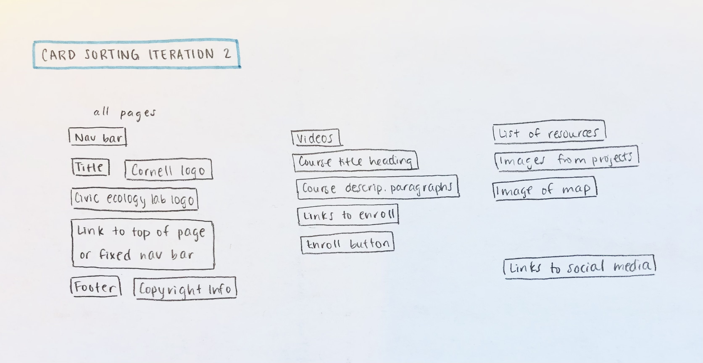

# Group Project: Design Journey

**You are encouraged to work ahead on everything on this project.** (Though we suggest you hold back on the interactivity until Project 3.) **Each section is required for a specific milestone. You are required to have these sections completed before that milestone's deadline.**

**Be clear and concise in your writing.** Bullets points are encouraged.

**Everything, including images, must be visible in Markdown Preview.** If it's not visible in Markdown Preview, then we won't grade it. We won't give you partial credit either. This is your warning.


# Client (Milestone 1)

## Client Questionnaire (Milestone 1)

1. Describe your organization and its purpose.
- Purpose 1: Engage the public. Let them know resources they have
- Purpose 2: Attract people to take course


2. What makes your organization and its services special or unique?
- Apply research to teaching → based on cutting edge research
- Course updated very often
- Researchers and professor from cornell
- Participants are a diverse, global audience: environmental educators, teachers k-12, high school students, volunteers, parents.
- Address real world challenges, specifically sustainability and environmental


3. Why are you looking for a new website or updating your existing site? Do you want to keep all the existing content or adjust them?
- Home Page: Principles of the organization (redesign to look more professional and easy to read.
- Specific courses: just a list of courses with videos, descriptions, and enrollment (redesign to look more appealing)
- Statistics page: just to show off what the lab has done (maybe do? Could be incorporated in the home page).
- Resources/Publications: should have a list of projects you can do in the lab. Used by teachers to develop lesson plans, 25 plans (split into two sites).
- Gallery page: for images related to lesson plans. Explore nature and take photos, explain why they relate to nature to you?
- Gathering page: social media posts, etc. (make it more lively).


4. Who do you want to visit your site? Who is your site's target audience?
- Global audience: environmental educators, teachers k-12, high school students, volunteers, parents.
- Students and teachers interested in joining or teaching in a Conrell ecology lab.


5. When visiting your site, what actions do you want your visitors to take?
- Register, download resources, and follow social media (facebook, inst)


6. Is there a "feel" that you want for your site? Are there colors or imagery that you have in mind?
- No strong preference
- Bright, environment
- Gallery page, with outcomes and map of students all over the world
- Maintain professionalism
- Does not have to be consistent with the rest of the site


7. What are your three favorite competitors or similar organizations' sites? Why?
- She really likes the content and design for the website for E Cornell.


## Client Description (Milestone 1)
> Tell us about your client. Who is your client?
> Explain why your client meets the client rules in the project requirements.

- Our client Yue Li is a Research Associate in the Department of Natural Resources and the Environment at Cornell University. And fulfills the clients rules because of the following:
  1. Our client is not one of the members of our group.
  2. None of us are associated with the Department of Natural Resources and the Environment.
  3. None of use knew who this client was before hand, and therefore have no close personal relationship with said client.


## Client Website (Milestone 1)
> Tell us about the website that your client wants. Tell us the purpose of the website and what it is all about.
> NOTE: **If you are redesigning an existing website, give us the current URL and some screenshots of the current site.** (FireFox makes it easy to take a full screenshot of a page.) Tell us how you plan to update the site in a significant way that meets the project's requirements.

The existing one has too many contents, and she wants us to just focus on the original learning page in the existing website and make a website covering four aspects of it: basic introduction, course description, resources, and a gallery of outcomes.
The purpose of the website is 1. engage the public and share resources about nature, and 2. Have audience register and take the course
Site link: <https://www.civicecology.org/>


## Client Website Scope (Milestone 1)
> Your project should be ambitious, but not too large. A good rule-of-thumb is that you should have about 1 content-full page for each team member.
> Explain why the website you will create for your client isn't too small and isn't too big. Explain why you think it's the right size for this project.

1. landing page
2. one specific course (urban) to redesign
3. resources page such as lesson page
4. gallery page like students social media page
	All four of the members will be making one page from above. Each page contains a considerable amount of information but does not get too specific.


## Client Goals (Milestone 1)
> What kind of website do they want? What are their goals for the site?
> There is no required number of goals. You need as many goals as necessary to reflect your client's desires.

They want a website that appeals to both students and teachers (but on separate sections of the website, excluding the home page).
The clients want their website to be more organized in the manner mentioned above.
A website that can keep their user engaged, even if they don’t want to actually join the lab it is advertising.

- Goal A: Register for courses
- Goal B: Download resources (lesson plans, lab journals).
- Goal C: Follow social media (facebook, insta).


## First Client Meeting Minutes/Notes (Milestone 1)
> Include your notes/minutes from the client meeting.

- Focus on nature education page
- Goal: engage public and share resources and research with general public
- Audience are professionals and educators, teacher, high schoolers, diverse
- Feature newest course at the top
- Possible intro video on landing page
- Include course principles
- Current page is too much → change so that it is easy to read, attract more people
- Redesign course description page
- Attract people to register and check other course registration pages


# Plan/Schedule (Milestone 1)
> Make a plan of when you will complete all parts of this assignment.
> This plan is for your team. There is no required format. Format it so that it works for you!
()

- m1:
    - deadline-Wed 10/27 11:59pm
    - plan: 10/26

- m2:
    - deadline-Wed 11/17 11:59pm
    - plan: 11/16 11:59pm

- final:
    - deadline-Wed 12/1 11:59pm
    - plan: 11/30 11:59pm

- lab13 project show:
    - deadline-Fri 12/3
    - plan: practice on Tuesday regular meeting

- peer evaluations:
    - deadline-Fri 12/3 11:59pm
    - plan: individually before deadline


# Site Design/Plan (Milestone 2)

**Make the case for your decisions using concepts from class, as well as other design principles, theories, examples, and cases from outside of class.**

You can use bullet points and lists, or full paragraphs, or a combo, whichever is appropriate. The writing should be solid draft quality but doesn't have to be fancy.

## Understanding Users (Milestone 2)

### Audience (Milestone 2)
> Briefly explain your site's audience. Be specific and justify why this audience is a cohesive group with regard to your client's site. This audience should not be overly broad nor arbitrarily specific. It should be a cohesive group with similar _goals_.

The site’s audience is a global community of educators, students, and volunteers who are interested in learning more about ecology through the Cornell Civic Ecology lab. They may be interested in learning about ecology for the purpose of teaching others, or for the sake of their own knowledge, or to apply this knowledge to their own research. While the audience is located all over the world, they have the common interest of obtaining ecology knowledge and can do so from the digital courses that the site offers.


### User Interview Questions (Milestone 2)
> Plan the user interview which you'll use to identify the goals of your site's audience.

**User Interview Briefing & Consent:** Hi, I am a student at Cornell University. I'm currently taking a class on web design and for a project I am (re-)designing a web site for _client's name_. I'm trying to learn more about the people that might use this site. May I ask you a few questions? It will take about 10-15 minutes. You are free to quit at any time.

1. Tell me about yourself. Where are you from and what do you do for a living (occupation)? (student: what are you interested in majoring in?) You may omit any personal or private information.
2. What is your background in ecology, if any?
  a. What other knowledge did you acquire?
  b. How do you plan on applying this knowledge in the future?
3. Have you taken any online or in-person ecology courses? (No matter the response) Describe your experience.
4. If you’ve registered for an ecology course before (if not ecology, any online course), did you seek out any information beforehand? Where did you seek out this information? What attracted you to register for your most recent course?
5. While taking the actual course, what were your most and least favorite moments in it?
6. After taking the course, was there any information you wish you had known about the course beforehand or information that you weren't able to find?
7. Did you seek out resources outside of the course?
  a. If so, why did you want to do it, and were those resources helpful?
8. What haven't I asked you today that you think would be valuable for me to know?


**After the interview:** This was really helpful. Thank you so much for agreeing to speak with me today. Have a great day!


### Interview Notes (Milestone 2)
> Interview at least 4 people from your audience. Take notes and include those notes here. Make sure to include a brief description of each interviewee.

**Interviewee 1:**
Description: Audrey Andres is a Cornell Hotel School student from the Bay Area in California.
Notes: Audrey loves Ecology, and she lived in the ecology house (a dorm)  last year at Cornell where she learned a lot of related knowledge about ecology. She is interested in sustainability and creating sustainable businesses. In her personal life, she has a passion for nature and the outdoors. She wants to work for or create her own company in the future focusing on sustainability and hospitality. Specifically, trying to make a benchmark restaurant that focuses on sustainability, since there is so much waste in the restaurant. With climate change, crewships, hotels and restaurants will have to address all of the waste of energy, food, etc. in their operations. She has not taken any online or in person ecology classes, but she is looking at enrolling in ecology classes at Cornell. She has seeked out ecology classes on Class Roster. For learning online, she likes to learn through videos and practice problems. If it is only through reading, nothing could really be absorbed. Most of her online classes are distributed through Canvas, and her least favorite part of Canvas is that the calendar does not have clear due dates, class times in one place. Her favorite part about Canvas is that Canvas is very convenient and she can use it on both her phone and the computer. She gained ecology knowledge mostly from the Cornell Library database or just by looking online through YouTube videos or webpages. Her purpose of researching ecology is for personal purposes/interests. I also showed her the existing webpage, and she pointed out that it would be helpful to put the courses front and center and have a description of the course.


**Interviewee 2:**

Description:
- Behzad Akbari
- From middle east
- Currently living in the capital of Iran
- 28 years old
- Graduated from University of Tehran
- Did masters in environment 6 months ago
- Received Bachelors in engineering in 2017
- Works at University at Tehran as an executive team manager

Notes:

2. What is your background in ecology, if any?
  - Took general ecology class in college
3. How do you plan on applying this knowledge in the future?
  - Wants to apply ecology knowledge in both professional and personal aspects of his life
  - Professional:
    - Want to pass ecology knowledge to other students
    - Wants to teach nature education
  - Personal:
    - Wants kids to grow up surrounded by nature
    - Wants people to reconnect with nature especially because of urbanization
4. Have you taken any online or in-person ecology courses? (No matter the response) Describe your experience.
  - Took “Nature Education” course from Civic Ecology Lab
  - Found it generous of them to have classes without a fee during covid
  - Dedicated several hours a week to course
  - Enjoyed how the course was “brief and enough” - not too short and too long
  - All online courses lasted only one hour so time management was perfect
5. If you’ve registered for an ecology course before (if not ecology, any online course), did you seek out any information beforehand? Where did you seek out this information? What attracted you to register for your most recent course?
First e-learning course
  - One of his friends advertised it in a group and applied for it
6. While taking the actual course, what were your most and least favorite moments in it?
  - Favorite moments:
    - Got a chance to talk to everyone including the professor
    - Course provided free pdf file, did not have to buy a textbook (no additional fees)
  - Least Favorite moment:
    - None so far
7. After taking the course, was there any information you wish you had known about the course beforehand or information that you weren't able to find?
  - Was fully satisfied
  - Did not seek outside info, everything needed was included in the course site
8. What haven't I asked you today that you think would be valuable for me to know?
  - Some people just lost their job, or are in a difficult situation, so would like if they offered an option to waive the fee even after covid
  - Wished that the people who took the course could be considered for possible research opportunities by professors (wants to gain connections from course)


**Interviewee 3:**

TODO: description
TODO: notes


**Interviewee 4:**

Description: He is a junior at Tufts University majoring in Environmental Science, Architecture, and Studio Art with a concentration in sculpture.

Notes:
- He gained interest in ecology through playing in the gorges and rivers during his childhood.
- His studies at college had helped him gain much more specific information and skills revolving around ecology.
- He plans on applying this knowledge in his artistic pursuits as well as architectural and design pursuits in his future career.
- He has taken both online and in person ecology courses. His experience with online courses has been relatively fine, with the exception of there being a lack of interactivity and fieldwork. Which is not an issue with in person courses, which provide much more hands-on learning opportunities.
- He has looked for course information prior to registering for an ecology course, which he found via friends/professors.
- His major requirements and personal interest in ecology are what attracted him to registering for his current courses.
- His favorite moments in online class were solving a problem and doing some sort of fieldwork. His least favorite moments always stem from poor communication on the part of the professor.
- There wasn’t any additional information he wished he had known after taking an online course.
- He did look for resources outside of this course, since he wanted to learn more about the topics that interest him and learn more about the world around me.
- Question asked by him: Information that was related more specifically to the connection between ecology and other aspects of my life?


### Goals (Milestone 2)
> Analyze your audience's goals from your notes above. List each goal below. There is no specific number of goals required for this, but you need enough to do the job (Hint: It's more than 1 and probably more than 2).

Goal 1: Give access to a comprehensive list of resources (links and papers) that the user can use for future ecological application.
- **Design Ideas and Choices** _How will you meet those goals in your design?_
  - Create a separate page dedicated to listing resources and including corresponding images associated with the resources.
- **Rationale & Additional Notes** _Justify your decisions; additional notes._
  - Users prefer additional resources to be separate from the broader contents of website, so that it is easier to find.
  - We will also include a list of projects that can act as a template for future research.

Goal 2: Better understand the courses from their description and be compelled to enroll
- **Design Ideas and Choices** _How will you meet those goals in your design?_
  - Reorganize courses so that the descriptions and videos are well structured
  - Make the enroll button clearly visible by using different colors
- **Rationale & Additional Notes** _Justify your decisions; additional notes._
  - Having a similar structure of information for each course will give the audience familiarity and be able to better navigate courses
  - Making the enroll button stand out will catch the audience's attention

Goal 3: Make the design of the website have the themes of security, professionalism, and community that users can easily attain.
- **Design Ideas and Choices** _How will you meet those goals in your design?_
  - Maintain the current color theme and font styles.
  - Make all of the content have a unified width and borders.
  - Have related content condensed and groups of content spaced out.
- **Rationale & Additional Notes** _Justify your decisions; additional notes._
  - Users need to be able to read the very informative-rich text quickly and without confusion.
  - Current users should not get lost when the design of the site changes too drastically.


## Content Planning (Milestone 2)

**Plan your site's content.**

### Your Site's Planned Content (Milestone 2)
> List the content you plan to include your personal website. This should be a comprehensive list.

- Title
- Course title heading
- Course description paragraphs
- Images from projects
- Links to social medias
- Links to enroll
- Videos
- Civic ecology lab logo
- Cornell logo
- Navigation bar
- Footer
- Link to top of page or fixed nav bar
- Copyright information
- Lists of resources and projects
- Enroll button
- Image of map


### Content Justification (Milestone 2)
> Explain (about a paragraph) why this content is the right content for your site's audience and how its addressed their goals..

The content listed above is suitable for our audience because it satisfies their goals. The list of resources and projects combined with their links will allow the audience to easily access this list. In addition, the course title heading and description paragraph will thoroughly explain each course and the separate enroll button element will be clearly visible so that the user does not have to search for it. Other content such as the social media links, logos, videos, and copyright information will contribute to the professionalism of the site and reassure the user that the provided information is reliable. There is also a sense of community from the image of the map that shows where people who have enrolled in these courses are from and the gallery page of example projects from students also contribute to the presence of this online community.


## Information Architecture (Milestone 2)

### Content Organization (Milestone 2)
> Document your iterations of card sorting here.
> Include photographic evidence of each iteration of card sorting and description of your thought process for each iteration.


Thought Process: TODO



Thought Process: My thought process for this card sorting was that all related content should have its own separate page on the website. For example: all content related to courses should be under the page called "Courses", such as videos, course descriptions, and the enrollment button. This excludes content such as the navigation bar and copy information, since it should always be visible to users no matter the page.


Thought Process: My thought process for this card sorting was to group the contents based on their information. For example, all information related to the courses were grouped together. Two of the groups were sorted based on their location on the page, such as content that appears on the top or bottom of every page.


Thought Process: TODO


### Final Content Organization (Milestone 2)
> Which iteration of card sorting will you use for your website?

We will use iteration 3 for our website.

> Explain how the final organization of content is appropriate for your site's audiences and their goals.

The final organization of the content aligns with the audience's goals and makes the website easy to navigate. In order to maintain professionalism throughout the site, the navigation bar, logos, and links to social medias will appear on every page either at the top or the bottom. The other four groupings will correspond to its own page and organizes the content based on its topic. One group contains information on the courses and enrollment while another group contains the list of resources. In addition to these pages, there is also the landing page which will include general content such as an introduction and a gallery page that will display images of past projects. This card sorting organizes all of the relevant content into logical groups that represents the information for each page or section of a page.


### Navigation (Milestone 2)
> Please list the pages you will include in your personal website navigation.

- Home
- Courses
- Resources & Projects
- Gallery

> Explain why the names of these pages make sense for your site's audience and their goals.

The names of these pages make sense because they are brief and concise so that the user can easily navigate to the desired content. These pages also align with our client's needs and separates all the information into logical categories. Since the main purpose of the Learning section of the Civic Ecology Lab is to present all of the online courses, it makes sense to position the Courses Page right after the Home Page.


## Design (Milestone 2)

### Visual Theme (Milestone 2)
> Discuss several (more than two) ideas about styling your site's theme. Explain why the theme ideas are appropriate for your target audiences.
> Note the theme you selected for you site and why it's appropriate for the audience and their goals.

Since our client prefers bright and professional colors that compliment the theme of nature, we are planning on using a color palette of about three to five colors throughout the site. Limiting our use of too many colors will ensure that our site remains professional and makes the audience feel a sense of security from our site. Possible color palettes are shades of green, brown, and blue as they all convey a sense of the natural environment. Another idea is to use simplistic fonts such as san serif fonts so that the text also appears clean and organized.


### Interactivity Ideas (Milestone 2)
> Brainstorm several ideas for your site's interactivity.
> Provide a very brief summary how each idea improves the usability of the site for the site's audience.

**Carousel**

We plan on implementing a carousel into the Gallery Page so that the user can view images of past projects. As our client wishes to have a separate carousel for each project, we will have several carousels that each display images from a specific project. This will help the user explore various projects and become interested in the course offerings.

**Tabs**
For the Course Page, we will organize the contents with tabs. So, while the course title and description will remain on the page, the user can switch tabs to view different information about the course, such as a course overview, frequently asked questions, and the instructors teaching the course. In this way, the course page will not be overwhelming with all of this information all at once and the user has more liberty to view the information needed and be more compelled to enroll.


### Layout Exploration (Milestone 2)
> Iterate on your site's design through sketching.
> Sketch both the mobile and desktop versions of the site.
> Here you are just exploring your layout ideas. You don't need to sketch every page.
> Provide an explanation for each sketch explaining the idea and the design patterns you are leveraging.


### Final Interactivity Design (Milestone 2)
> Explain and/or provide annotated sketches of the interactivity you will implement for your site.
> Explain how the interactivity improves the usability of the site and helps the site's audiences meet their goals.

**Tab Design**


**Carousel Design**


### Final Design (Milestone 2)
> Include the final sketches for **each** of your site's pages.
> The sketches must include enough detail that another 1300 student could implement them.
> Provide a explanation for each sketch.

**Mobile Design:**
TODO


**Desktop Design:**
1. **Home Page**

Explanation: a background image that takes a wide space, with texts devided into chunks. Each chunk  contains some brieft description of the lab, including Intro, expectation, and short intro video.  


2. **Course Page**

Explanation: The first section on the top is the course title (in h1) with an enroll botton below. Next would be a cover image of the course.
Below we plan to use tabs to organize each aspect of the course, and each tab includes, for example, course Delivery and participants.


3. **Resource Page**

Explanation: It contains two parts: Projects and Publication. Each part has an overview by listing out works they have done. Each work takes a whole line and is clickable (which will direct to another page just about that piece of work). According to the client meeting, the Lesson Plans is optional here so we will wait for finishing the html to see if having lesson plans would look good here.


4. **Gallery Page**

Explanation: we plan to use a carousel to display all images.


### Design Rationale (Milestone 2)
> Explain why your design is appropriate for your audience. Specially, why does your content organization, navigation, and site design/layout meet the goals of your users? How did you employ design patterns to improve the familiarity of the site for your audience?

For each page, we choose different types of layout.
1. **Home Page**
Explanation: The current learning website has different sections of texts aligned horinzontally (side by side). For example, the list of courses offered and an intro of the lab were put side by side. Since they are both texts, users would find too many texts in one place. We plan to everything with different topics vertically, and it followes reader's way to skim the website.


2. **Course Page**
Explanation: Currently the course page has too many contents, and users need to scroll multiple times to see all of them. Therefore, we will use tab to first show users all aspects of descriptions to this course that we have. In our interview, different users cares about different things before registering the course, so that they might have a faster way to have access to that piece of information thay are interested in. Using a tab feature, users could directly go to the part that they wish to know more without reading other information they are not interested in while scrolling.


3. **Resource Page**
Explanation: In our client meeting, our client wish to have two sections for this page: projects and publication. Though have more than one topics, we still don't plan to a tab bar like we will do for the course page. It is because that there will only be two topics, and for each topic there will only be an overview and thus there won't be many contents shown on the web. For example, under the publication section, we will list out a limited chosen number of publications, with each having a link to another page with more detailed description of that publication.


4. **Gallery Page**
Explanation: Since we have many images with details that users may zoom in to see clearly, for example, the map showing where all participants are from, we plan to use a carousel. In this way, users would see it clearly directly without manually zooming in or doing other steps, and carousel is also a familiar design that shows images so that users woudl know how to browse.


## Interactivity Plan (Milestone 2)
> Now that you've designed your interactivity for your site, you need to plan how you will implement it.
> Describe how you will implement the interactivity. This should be a complete plan that another 1300 student could use to implement the interactivity.
> You should list the elements, any CSS classes, events, pseudocode, and the initial state.

**Tab Interactivity**

HTML
- About button: `<div id="button-about">`
- Content button: `<div id="button-content">`
- Instructors button: `<div id="button-instructors">`
- Goal button: `<div id="button-goal">`
- FAQ button: `<div id="button-faq">`
- About tab: `<div id="tab-about">`
- Content tab: `<div id="tab-content">`
- Instructors tab: `<div id="tab-instructors">`
- Goal tab: `<div id="tab-goal">`
- FAQ tab: `<div id="tab-faq">`


CSS
- #button-about, #button-content, #button-instructors, #button-goal, #button-goal: style like buttons with white background color.
- #button-about: hover
- #button-content: hover
- #button-instructors: hover
- #button-goal: hover
- #button-goal: hover - cursor turns pointer on hover, font-color turns darker on hover.
- #button-about: focus
- #button-content: focus
- #button-instructors: focus
- #button-goal: focus
- #button-goal: focus - font-color stays darker when clicked
- .hidden: hides element


Javascript
```
When #button-about is clicked,
remove .accessible-hidden from #tab-about,
add .accessible-hidden to #tab-content, #tab-instructors, #tab-goal, #tab-faq. (This would be the initial state.)
When #button-content is clicked,
remove .accessible-hidden from #tab-content,
add .accessible-hidden to #tab-about, #tab-instructors, #tab-goal, #tab-faq.
When #button-instructors is clicked,
remove .accessible-hidden from #tab-instructors,
add .accessible-hidden to #tab-about, #tab-content, #tab-goal, #tab-faq.
When #button-goal is clicked,
remove .accessible-hidden from #tab-goal,
add .accessible-hidden to #tab-about, #tab-content, #tab-instructors, #tab-faq.
When #button-faq is clicked,
remove .accessible-hidden from #tab-faq,
add .accessible-hidden to #tab-about, #tab-content, #tab-instructors, #tab-goal.
```


## Client Feedback & Minutes (Milestone 2)
> You should meet with your client again to obtain feedback on your design.
> Provide a summary of the client's feedback and your meeting's minutes.

Home page
- Don’t highlight video, outdated
- Find any image nature for banner
- Can use images from online too

Course page
- Take urban environmental course and redesign
- Only redesign one course
- Same structure for each course
- Tab with separate pages or all on one page is up to us

Resources page
- Categorize by each project
- Maybe add few sentences ant what resource project is about, but if too much text then tile and authors is fine as well

- Have a page just to highlight online learning research and publication
- Separate it from current research
- Online Learning Research (main title)
    - Projects (subtitle)
    - Publications (subtitle)
    - Lesson Plans (subtitle)
- Maybe have section of lesson plan under resources and have links to download lesson plan pdfs

Map
- Client will send list of countries and map with points
- Little description for each location

Nav bar
- Client prefers to have fixed nav bar

Gallery
- Multiple carousels to separate images by topic
- Find a way to add description to bottom of image


# Evaluation (Final Submission)

## Finished Desktop & Mobile Website (Final Submission)
> Include screenshots of both the desktop and mobile version of your site that you will be using for user testing. (We need to see the "before" testing version of your site.)
> Use the FireFox screenshot feature to take screenshots of the entire page.

**Mobile Screenshots:**
TODO


**Desktop Screenshots:**
TODO


## User Testing (Final Submission)

**Conduct user testing with a minimum of 4 participants.**

### User Testing Tasks (Final Submission)
> Plan out your user testing tasks before doing your user testing. These must be actual user testing tasks. **Tasks are not questions!**

1. TODO

2. TODO

3. TODO


### User 1 - Testing Notes (Final Submission)
> When conducting user testing, you should take notes during the test. Place your notes here.

TODO


### User 1 (Final Submission)
> Using your notes from above, describe your user by answering the questions below.

1. Who is your user, e.g., where does the user come from, what is the user's job, characteristics, etc.?

TODO


2. Does the user belong to your audience of the site? (Yes / No)
> If “No”, what’s your strategy of associating the user test results to your audience’s needs and wants? How can your re-design choices based on the user tests make a better fit for the audience?

TODO


### User 1 Results (Final Submission)
> Report the results of your user's test. You should explain **what the user did**, describe the user's **reaction/feedback** to the design, **reflect on the user's performance**, determine what **re-design choices** you will make **for EACH task**. You can also add any additional comments.

Task: TODO: copy task here
- **Did you evaluate the desktop or mobile design?**
  - Pick one: desktop/mobile
- **How did the user do? Did they meet your expectation?**
  - TODO
- **User’s reaction / feedback to the design** (e.g., specific problems or issues found in the tasks)
  - TODO
- **Your reflections about the user’s performance to the task**
  - TODO
- **Re-design choices**
  - TODO
- **Additional Notes**
  - TODO: Justify your decisions; additional notes.

TODO...


### User 2 - Testing Notes (Final Submission)
> When conducting user testing, you should take notes during the test. Place your notes here.

TODO


### User 2 (Final Submission)
> Using your notes from above, describe your user by answering the questions below.

1. Who is your user, e.g., where does the user come from, what is the user's job, characteristics, etc.?

TODO


2. Does the user belong to your audience of the site? (Yes / No)
> If “No”, what’s your strategy of associating the user test results to your audience’s needs and wants? How can your re-design choices based on the user tests make a better fit for the audience?

TODO


### User 2 Results (Final Submission)
> Report the results of your user's evaluation. You should explain **what the user did**, describe the user's **reaction/feedback** to the design, **reflect on the user's performance**, determine what **re-design choices** you will make **for EACH task**. You can also add any additional comments.

Task: TODO: copy task here
- **Did you evaluate the desktop or mobile design?**
  - Pick one: desktop/mobile
- **How did the user do? Did they meet your expectation?**
  - TODO
- **User’s reaction / feedback to the design** (e.g., specific problems or issues found in the tasks)
  - TODO
- **Your reflections about the user’s performance to the task**
  - TODO
- **Re-design choices**
  - TODO
- **Additional Notes**
  - TODO: Justify your decisions; additional notes.

TODO...


### User 3 - Testing Notes (Final Submission)
> When conducting user testing, you should take notes during the test. Place your notes here.

TODO


### User 3 (Final Submission)
> Using your notes from above, describe your user by answering the questions below.

1. Who is your user, e.g., where does the user come from, what is the user's job, characteristics, etc.?

TODO


2. Does the user belong to your audience of the site? (Yes / No)
> If “No”, what’s your strategy of associating the user test results to your audience’s needs and wants? How can your re-design choices based on the user tests make a better fit for the audience?

TODO


### User 3 Results (Final Submission)
> Report the results of your user's evaluation. You should explain **what the user did**, describe the user's **reaction/feedback** to the design, **reflect on the user's performance**, determine what **re-design choices** you will make **for EACH task**. You can also add any additional comments.

Task: TODO: copy task here
- **Did you evaluate the desktop or mobile design?**
  - Pick one: desktop/mobile
- **How did the user do? Did they meet your expectation?**
  - TODO
- **User’s reaction / feedback to the design** (e.g., specific problems or issues found in the tasks)
  - TODO
- **Your reflections about the user’s performance to the task**
  - TODO
- **Re-design choices**
  - TODO
- **Additional Notes**
  - TODO: Justify your decisions; additional notes.

TODO...


### User 4 - Testing Notes (Final Submission)
> When conducting user testing, you should take notes during the test. Place your notes here.

TODO


### User 4 (Final Submission)
> Using your notes from above, describe your user by answering the questions below.

1. Who is your user, e.g., where does the user come from, what is the user's job, characteristics, etc.?

TODO


2. Does the user belong to your audience of the site? (Yes / No)
> If “No”, what’s your strategy of associating the user test results to your audience’s needs and wants? How can your re-design choices based on the user tests make a better fit for the audience?

TODO


### User 4 Results (Final Submission)
> Report the results of your user's evaluation. You should explain **what the user did**, describe the user's **reaction/feedback** to the design, **reflect on the user's performance**, determine what **re-design choices** you will make **for EACH task**. You can also add any additional comments.

Task: TODO: copy task here
- **Did you evaluate the desktop or mobile design?**
  - Pick one: desktop/mobile
- **How did the user do? Did they meet your expectation?**
  - TODO
- **User’s reaction / feedback to the design** (e.g., specific problems or issues found in the tasks)
  - TODO
- **Your reflections about the user’s performance to the task**
  - TODO
- **Re-design choices**
  - TODO
- **Additional Notes**
  - TODO: Justify your decisions; additional notes.

TODO...


## Changes Based on User Testing (Final Submission)
> What changes did you make to your design based on user testing?

TODO


## Final Notes to the Graders (Final Submission)
> 1. Give us three specific strengths of your site that sets it apart from the previous website of the client (if applicable) and/or from other websites. Think of this as your chance to argue for the things you did really well.

TODO

> 2. Tell us what you, as a team, learned while working on this project.

TODO

> 3. Tell us anything else you need us to know for when we're looking at the project.

TODO
